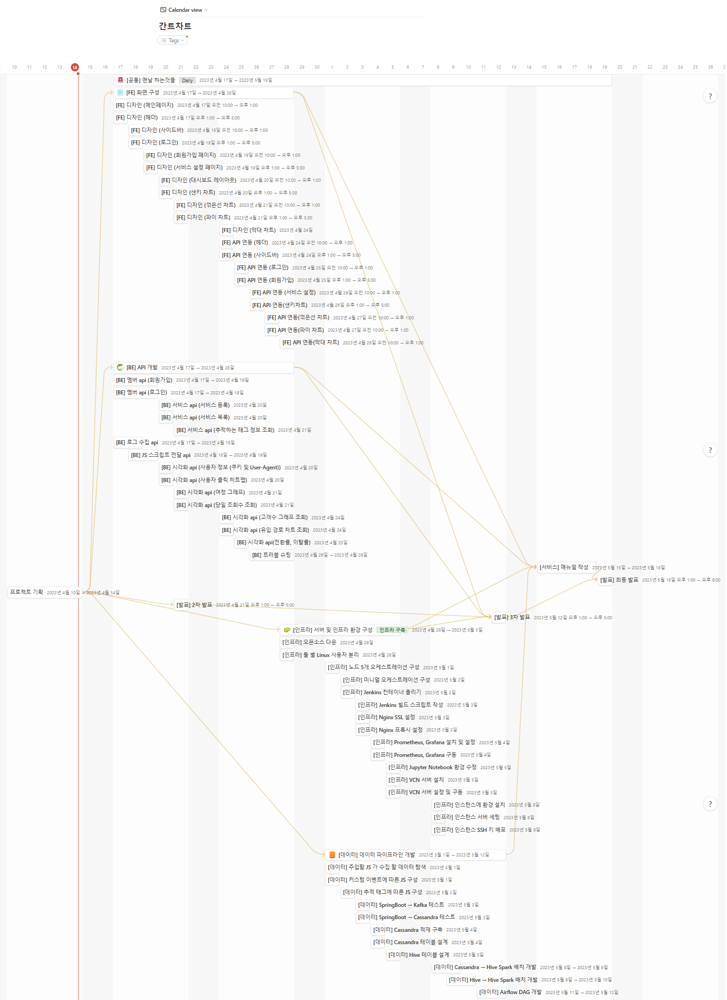

## 1주차 (04/10 ~ 04/14) - 기획
- 전체적인 기획 수립 
  - 기획서
  - 와이어 프레임
  - 기능 명세서
  - API 연동 규격서
  - 시퀀스 다이어그램
  - 플로우 차트
  - ERD
  
- 간트차트 작성 (FE, BE, Infra, Data로 세분화)

## 2주차 (04/17 ~ 04/21) 본격적인 개발 시작
### 04/17
- FE
  - 전체적인 페이지 디자인... (헤더바, 사이드바, 메인페이지, 로그인페이지 등등)
  - recharts을 채택, 차트 커스텀중
- BE
  - 코드 리팩토링 -ing
