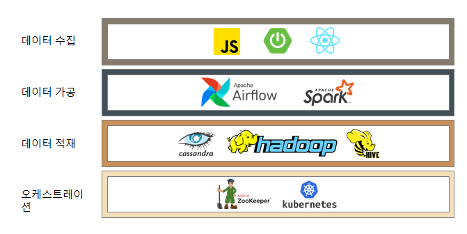
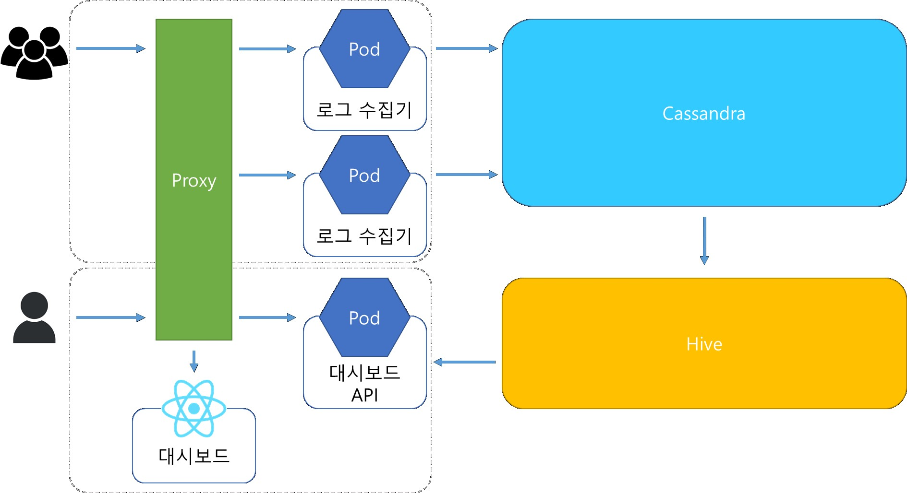

# SSAFY 특화 프로젝트

## 팀 마타2(A309)

# 🌐 MATA21 링크 : [대시보드 링크](http://mata2.co.kr/)

# 🎞 소개 영상 보기 :

# 📆 프로젝트 진행 기간

2023/04/10 ~ 2023/05/26

# 📖 MATA 는 무엇인가요?

## 🗻Our Vision

웹 페이지의 UX를 향상시키기 위해 고객의 동선을 파악하여

고객 여정 지도를 그리는 것은 비즈니스 차원에서 필수입니다.

서비스에 접근하는 모든 고객의 동선을 수집하여 이를 자동화 하고  

클라이언트의 각종 업무를 돕는것이 MATA의 역할입니다.

## 🎯Our Solution

웹 사이트 이용자의 사이트 내 동선 데이터를 수집합니다.  

수집된 데이터를 처리, 변환하여 적재합니다.  

사이트 관리자 및 운영자에게 사이트 내 흐름에 대한 시각화 정보를 제공합니다.

## 💎Our Value

웹 사이트의 발전과 성장을 위한 인사이트를 제공합니다.

# 💜 주요 기능

---

### 컴포넌트 별 통계

이미지

### ~~~ 별 통계

이미지

### ~~~ 별 통계

이미지

# ✔ 주요 기술

---

**Data cluster - Hadoop Ecosystem**

Hadoop

Zookeeper

Kafka

Spark

Cassandra

Hive

Airflow

MySQL

**Backend - Spring**

Spring Boot

Spring Web

JPA

JDBC Template

JWT

Spring Security

Spring for Kafka

**Frontend**

React

Bootstrap

Tailwind

**Database**

MySQL

Redis

Hive

**CI/CD**

AWS EC2

NginX

Jenkins

Docker

Docker Compose

Kubernetes

# ✔ 프로젝트 아키텍쳐

---

## MATA Architecture


## Data Cluster Architecture



## Data Flow



# ✔ 프로젝트 구조

---

## 디렉토리 설명

### `react-app`

- React 애플리케이션
- 웹사이트 로그 생성 역할
- 테스트용 서버

### `bigdata-api`

- Springboot 애플리케이션
- React 앱 혹은 html에서 전달된 데이터를 받아오고 접근 권한을 부여하는 역할
- Kafka server에 데이터를 넘겨주는 역할
- Hive, MySQL 등 DB에서 API를 통해 데이터를 조회하는 역할

### `mata2`

- React 애플리케이션
- 대쉬보드 페이지 서버

### `hadoop-cluster`

- Hadoop Ecosystem 스크립트
- Kafka, Hive, Airflow 등 다양한 툴을 가지는 분산 데이터 플랫폼
- Docker 기반 분산 운영

### `Docs`

- 개인공부, 회의록 등 문서를 정리한 공간

## 디렉토리 구조

### Frontend

```
\mata2\SRC
|   App.css
|   App.js
|   App.test.js
|   index.css
|   index.js
|   input.css
|   logo.svg
|   reportWebVitals.js
|   setupTests.js
|   tagmanager.js
|
+---assets
|       item-project-icon.svg
|       loginBackground.svg
|       Service_add_icon.svg
|       tagmanager.js
|       Welcome.jpg
|
+---components
|       DropdownComponent.js
|       Header.js
|       Sidebar.css
|       Sidebar.js
|
+---dashboards
|   |   DashboardMain.css
|   |   DashboardMain.js
|   |
|   +---areachart
|   |       DemoAreaChart.js
|   |       DurationsAreaChart.js
|   |
|   +---barchart
|   |       DemoBarChart.js
|   |       ReferBarChart.js
|   |
|   +---linechart
|   |       DemoLineChart.js
|   |       DurationLineChart.js
|   |
|   +---piechart
|   |       DemoPieChart.js
|   |
|   \---sankeychart
|           DemoSankeyChart.js
|           DemoSankeyLink.js
|           DemoSankeyNode.js
|
+---layout
|       DashboardLayout.js
|       WelcomeLayout.js
|
\---views
        Collapse.js
        GettingStarted.js
        Login.css
        Login.js
        Logout.js
        ServiceAdd.css
        ServiceAdd.js
        ServiceCustom.css
        ServiceCustom.js
        ServiceStart.js
        SignUp.css
        SignUp.js
        Test.js
        Welcome.css
        Welcome.js
```

### Backend

```
\BIGDATA-API
|   deployment.yml
|   docker-entrypoint.sh
|   Dockerfile
|   HELP.md
|   mvnw
|   mvnw.cmd
|   package-lock.json
|   pom.xml
|   README.md
|   service.yml
|
+---redis
|       redis.conf
|
\---src
    \---main
        +---java
        |   \---com
        |       \---ssafy
        |           |   DummyData.java
        |           |   MataApiServerApplication.java
        |           |
        |           +---config
        |           |       CassandraConfig.java
        |           |       ControllerAdvice.java
        |           |       HiveConfiguration.java
        |           |       KafkaAdminConfig.java
        |           |       KafkaProducerConfig.java
        |           |       MySqlConfiguration.java
        |           |       RedisConfig.java
        |           |       SecurityUtils.java
        |           |       WebMvcConfig.java
        |           |       WebSecurityConfig.java
        |           |
        |           +---controller
        |           |       AnalyticsController.java
        |           |       EventController.java
        |           |       MemberController.java
        |           |       ProjectController.java
        |           |       TagManagerController.java
        |           |
        |           +---dto
        |           |       ClientTokenDto.java
        |           |       ErrorDto.java
        |           |       EventDto.java
        |           |       EventParamDto.java
        |           |       EventPathDto.java
        |           |       MemberDto.java
        |           |       MemberInfoDto.java
        |           |       MemberInfoResponse.java
        |           |       MemberLoginDto.java
        |           |       MemberSignUpDto.java
        |           |       NoSuchProjectException.java
        |           |       ProjectAddDto.java
        |           |       ProjectDeleteDto.java
        |           |       ProjectDto.java
        |           |       ProjectResponse.java
        |           |       SaveEventDto.java
        |           |       SaveEventListDto.java
        |           |       SaveEventParamDto.java
        |           |       SaveEventPathDto.java
        |           |       SaveTagDto.java
        |           |       SaveTagListDto.java
        |           |       SettingDto.java
        |           |       Stream.java
        |           |       TagDto.java
        |           |       TagEventDto.java
        |           |       TokenDto.java
        |           |       WebLogDto.java
        |           |
        |           +---entity
        |           |       Event.java
        |           |       EventParam.java
        |           |       EventPath.java
        |           |       HiveClick.java
        |           |       HiveComponent.java
        |           |       HiveEvent.java
        |           |       HivePageDuration.java
        |           |       HivePageJournal.java
        |           |       HivePageRefer.java
        |           |       Member.java
        |           |       Project.java
        |           |       Referrer.java
        |           |       Tag.java
        |           |       TagEvent.java
        |           |
        |           +---repository
        |           |       EventParamRepository.java
        |           |       EventPathRepository.java
        |           |       EventRepository.java
        |           |       HiveRepository.java
        |           |       MemberRepository.java
        |           |       ProjectRepository.java
        |           |       TagEventRepository.java
        |           |       TagRepository.java
        |           |       WeblogRepository.java
        |           |
        |           +---service
        |           |       CassandraService.java
        |           |       CustomUserDetailsService.java
        |           |       HiveService.java
        |           |       InjectionService.java
        |           |       KafkaProducerService.java
        |           |       MemberService.java
        |           |       ProjectService.java
        |           |
        |           \---util
        |                   Authority.java
        |                   DuplicateMemberException.java
        |                   JwtAuthenticationFilter.java
        |                   JwtTokenProvider.java
        |                   MemberPrivilege.java
        |                   NoSuchMemberException.java
        |                   ProjectCategory.java
        |                   RedisKeyExecption.java
        |                   Validation.java
        |
        \---resources
                application.yml
```

### Data Cluster

# ✔ 협업

---

### Jira 를 통한 협업

- 프로젝트를 진행하며 1주당 하나의 스프린트, 총 5개의 스프린트를 진행
- 한 주의 시작마다 인당 총 40시간의 이슈를 생성하고 스프린트를 시작
- 1~4시간의 이슈를 생성하여 작업을 시작할 때 마다 해당 이슈를 진행중 표시
- 작업이 완료 되면 해당 이슈를 완료 표시 한 후, 다음 작업을 진행
- 한 주의 마지막에 스프린트를 종료하여 리뷰하는 시간을 가짐

### Gitlab 을 통한 협업

- master, develop, feature의 git flow 브랜칭 전략을 통해 작업 브랜치를 분할 관리
- 새로운 기능 개발이나 버그픽스를 위해 feature 브랜치를 사용
- 개발 현황을 병합하고 새로운 개발 브랜치를 분기하기 위해 develop 브랜치를 사용

# ✔ 팀원 역할 분배

---

### 정준호 (팀장)

`Frontend` `Backend` `System`

- 데이터 플랫폼 아키텍쳐 설계
- 데이터 플랫폼 구축
- 실시간 ETL 파이프라인 개발
- 배치 ETL 파이프라인 개발
- 리눅스 개발 환경 개선

### 이태희

`Frontend` `Backend` `Data Warehouse`

- Spring boot 기반 회원, 프로젝트 도메인 API 작성
- React 기반 히트맵 컴포넌트 개발
- Cassandra To Hive를 위한 Spark스크립트 작성
- VPN 환경 구축
- 쿠버네티스 도입
- 모니터링 웹 UI 설정
- ERD 제작

### 김호성

`Frontend`  `Data Warehouse`

- React app 개발
- React rechart, grid-layout 기반 대시보드 컴포넌트 개발
- Cassandra To Hive를 위한 Spark스크립트 작성

### 이진욱

`Frontend` `Backend`

- Spring boot 기반 회원, 프로젝트 도메인 API 작성
- React 기반 대시보드 컴포넌트 개발
- Ucc 촬영 및 편집

### 함형준

`Frontend` `Backend` `Workflow Management`

- Airflow Dag 작성
- Data Workflow 자동화
- Hive 데이터 조회 쿼리 작성
- React 기반 여정지도 컴포넌트 개발
- Hive ERD 설계
- SparkSQL 쿼리 작성
- Ucc 출연

# ✔ 프로젝트 산출물

---

- [서비스 ERD](Docs/서비스%20ERD.png)
- [Hive ERD](Docs/Hive%20ERD.png)
- [서비스 API 목록](Docs/API%20목록.html)
- [최종 발표 PPT]()
- [포딩 매뉴얼](Docs/포딩매뉴얼.docx)

# 📊 MATA 대시보드 화면

---
